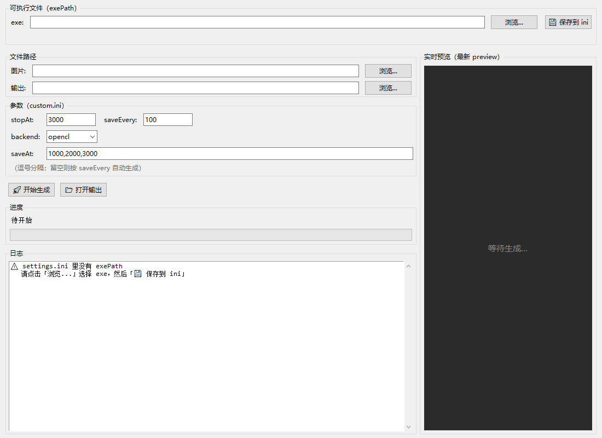
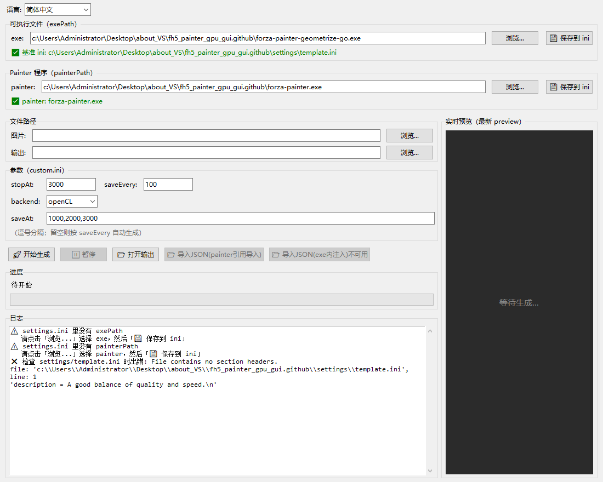
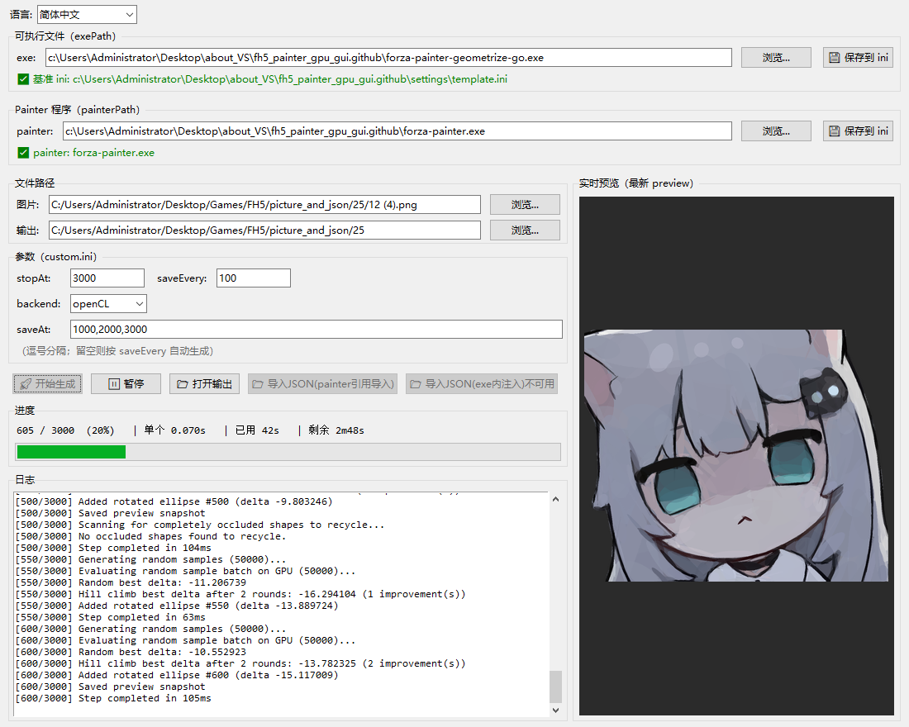

# FH5 Painter GPU GUI

A simple GUI for generating Forza Horizon 5 vinyl groups using
`forza-painter-geometrize-go`.

一个用于生成《极限竞速：地平线 5》涂装的图形界面工具，底层调用
`forza-painter-geometrize-go`。

- `forza-painter-geometrize-go` 来自 @zjl88858
  https://github.com/zjl88858/forza-painter-geometrize-gpu

- 外部JSON导入来自@`forza-master`的`forza-master.exe`,内部导入为自己设计的内存注入工具 
---

## Features / 功能

- Simple graphical interface / 简洁的图形界面
- Adjustable `stopAt` / `saveAt` / `saveEvery` / 可调整的形状数量与快照参数
- Real-time progress bar / 实时进度条
- Live preview of the latest snapshot / 实时预览最新快照
- **Pause / Resume during generation / 生成过程中可暂停与继续**
- **Multi-language UI: 简体中文 / 繁體中文 / English / 界面多语言支持**
- **Auto-detect & auto-download `exe` / `painter` from GitHub on first launch / 首次启动时自动检查并从 GitHub 下载 `exe` 与 `painter`**
- **Choose OpenCL / Vulkan backend in the GUI / 界面内可选 OpenCL / Vulkan 后端**
- **Closing the window terminates the background renderer process tree / 关闭窗口时自动终止后台渲染进程树**
- Configurable exe path via `settings.ini` / 通过 `settings.ini` 配置 exe 路径
- All JSON files are kept, only the latest preview is kept / 所有 JSON 均保留，预览图只留最新一张

---

## Project structure / 项目结构

```text
fh5_painter_gpu_gui/
├── main.py              # GUI + entry point / 图形界面与入口
├── tools.py             # paths, settings.ini, auto-download / 路径、配置、下载
├── gpu_geometrize.py    # renderer invocation, JSON conversion / 渲染调用与 JSON 转换
├── settings.ini         # generated on first run / 首次运行生成
├── settings/
│   └── template.ini     # generated on first run / 首次运行生成
├── runtime/             # temporary working dir / 临时工作目录
└── docs/
    ├── src0.png
    ├── src1.png
    └── src2.png
├──publish.py # 打包
└──publish.ps1 #打包
```

---

## Requirements / 依赖

- Python 3.10+ (3.12 recommended / 推荐 3.12)
- `requests`
- `psutil` (for pause/resume & killing the process tree / 用于暂停、继续与杀进程树)
- `Pillow` (optional, for smooth preview scaling / 可选，用于预览图平滑缩放)

```powershell
pip install requests psutil pillow
```

---

## How to use / 使用方法

1. Download the files / 先下载文件。

### Onefile version / 打包版本

- Open `FH5Painter.onefile.exe` / 打开 `FH5Painter.onefile.exe`
- The first launch will automatically check `exe` / `painter` and download them from GitHub
  if missing / 首次启动会自动检查并从 GitHub 下载 `exe` 与 `painter`

### Python version / Python 文件

- Run `main.py` / 运行 `main.py`

```powershell
python main.py
```

### Building the executable / 打包

```powershell
pyinstaller --onefile --windowed --name FH5Painter `
    --hidden-import PIL `
    --hidden-import PIL._tkinter_finder `
    --collect-data certifi `
    main.py
```

### Attention / 注意事项

- The `-backend` flag uses a **single dash** (Go `flag` style). Using
  `--backend` may be silently ignored / `-backend` 为**单破折号**（Go `flag`
  风格），写成 `--backend` 可能被渲染器静默忽略。
- If `Vulkan` fails to start (driver / runtime issues), the renderer will
  exit immediately and the log panel shows an error. Switch to `OpenCL` or
  update your GPU driver / 若 `Vulkan` 因驱动或运行时问题启动失败，渲染器会
  立即退出并在日志区提示，请切换到 `OpenCL` 或更新显卡驱动。
- Do **not** place the executable under a write-protected folder such as
  `C:\Program Files\`. The tool writes `settings.ini`, `settings/` and
  `runtime/` next to the executable / 请勿将程序放在 `C:\Program Files\`
  这类无写权限的目录下，程序会在同级目录生成 `settings.ini`、`settings/`
  与 `runtime/`。

Manually invoking the renderer from PowerShell / 也可手动调用渲染器：

```powershell
.\dist\forza-painter-geometrize-go.exe `
    -backend vulkan `
    -output "C:/to/output/prefix" `
    -preview "C:/to/output/prefix_preview.png" `
    "C:/to/input.png"
```

---

## Screenshots / 应用图片





---

## Changelog / 更新记录

- **Multi-language UI** (简体中文 / 繁體中文 / English) / 界面多语言
- **Pause / Resume** the running renderer / 可暂停与继续当前渲染
- **Auto download** `forza-painter-geometrize-go.exe` and `forza-painter.exe` from GitHub Releases on first launch / 首次启动自动从 GitHub Releases 下载 `exe` 与 `painter`
- **Fixed** backend flag: `--backend` → `-backend` (Vulkan now works) / 修复 backend 参数拼写，Vulkan 现可正常使用
- **Fixed** background renderer process not exiting after closing the GUI / 修复关闭 GUI 后渲染器进程仍在后台的问题
- Split into `main.py` / `tools.py` / `gpu_geometrize.py` / 拆分为三个模块
- JSON import via Painter for FH5 / FH4 / JSON 可通过 Painter 导入 FH5、FH4
- Fixed bugs in file update, error handling and format / 修复了文件更新、报错与格式相关的 BUG

---

## Credits / 致谢

- `forza-painter-geometrize-go` by @zjl88858
- GUI by @LZR-lzr-lzr
- `forza-master` by @forza-master